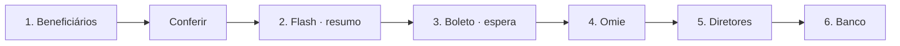
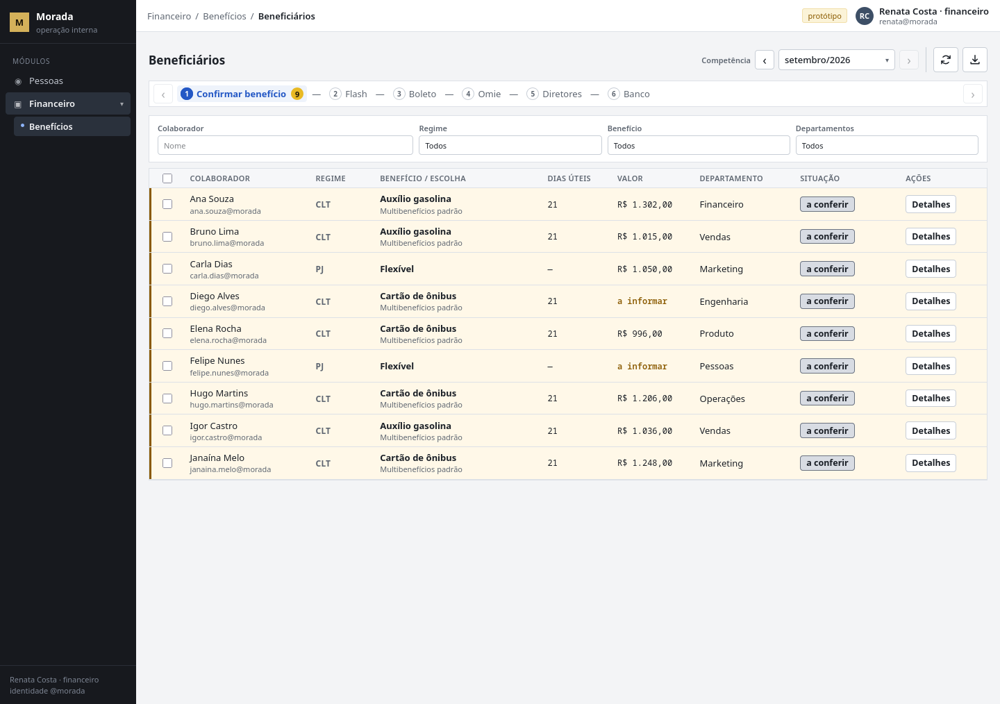
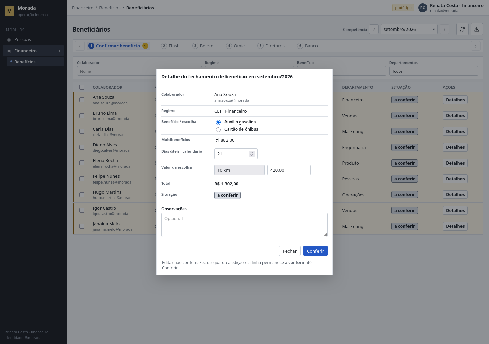
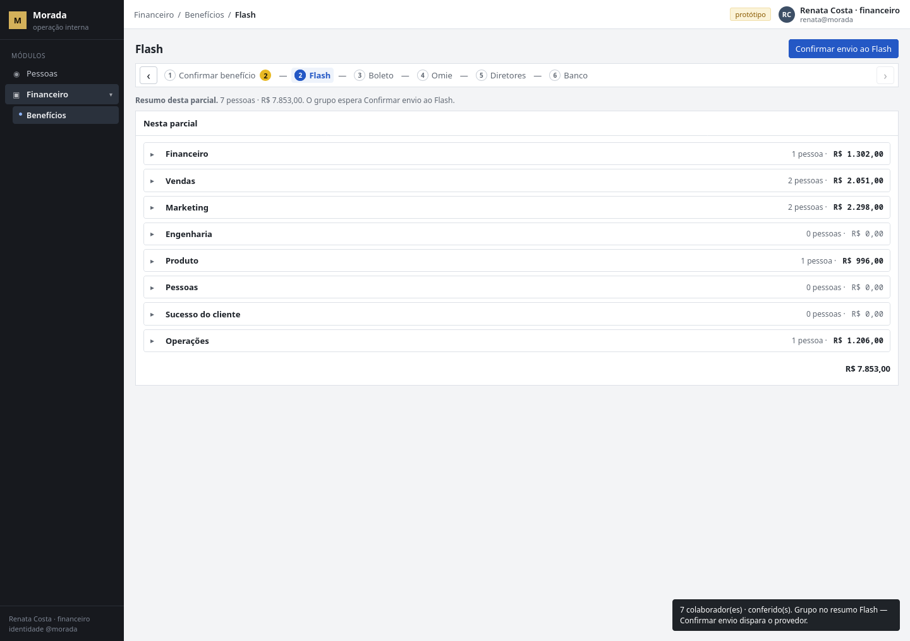
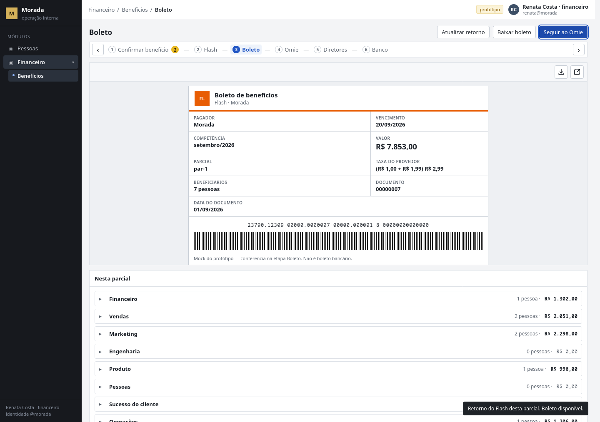
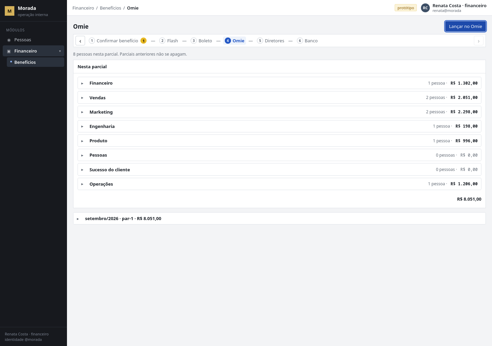
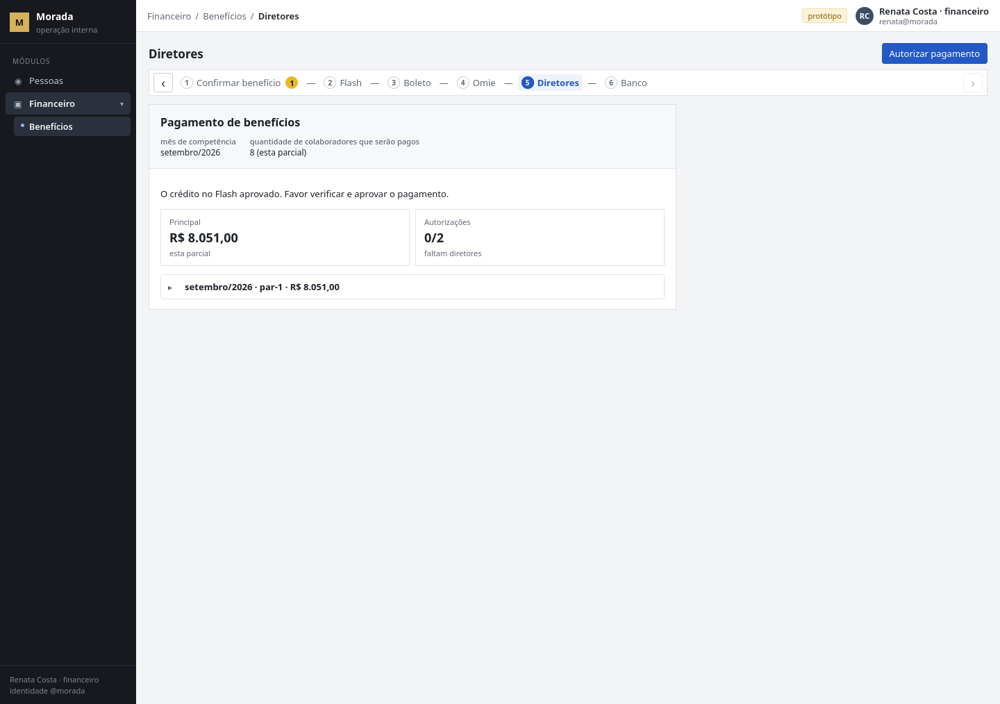
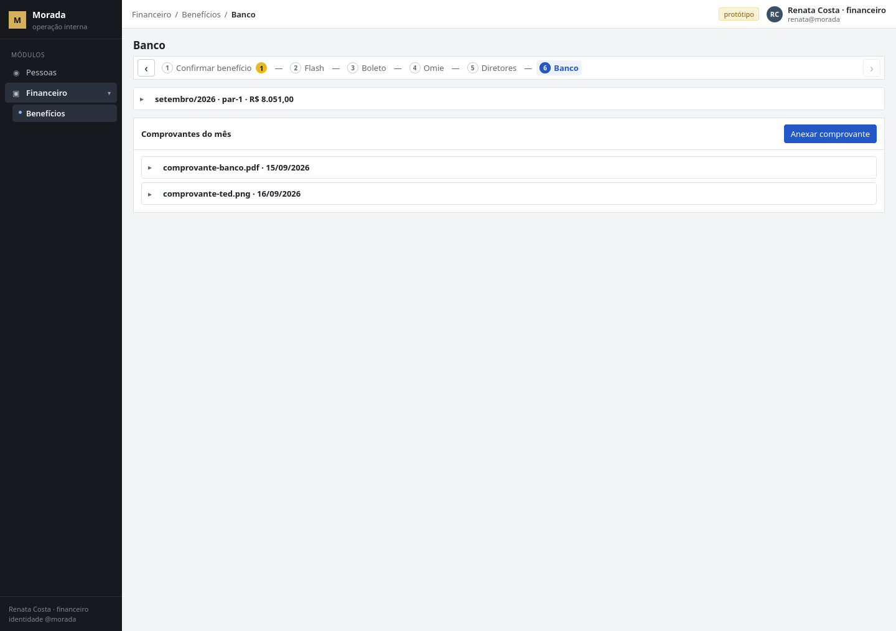

Otimização na operação de pagamento de benefícios

A proposta de como a melhoria do o ciclo mensal de recarga dos cartões de benefício dos colaboradores, a partir da conversa com o financeiro.

1. Reformulação

O financeiro sofre com a planilha tentar ser a política de beneficícios por colaborador, usando o painel Flash dezenas de vezes (pessoa × modalidade × valor), aumentando o tempo demandado para a função e os possíveis erros operacionais. Assumi que o boleto fique salvo na planilha também;

Todo mês, três pessoas fecham ~73 colaboradores em 8 departamentos. CLT: Multibenefícios (padrão) + escolha única: ônibus ou auxílio gasolina. PJ: Flexível, sem escolha extra. A diretoria aprova por e-mail um relatório que não trava o crédito.

1. Causa / hipóteses

h1 - Digitação muito demorada no Flash. 

O painel força entrada pessoa × modalidade × valor e não reusa a elegibilidade da admissão. Fato: o financeiro descreveu o lançamento pessoa a pessoa e apontou o painel como o trecho lento.

h2 - Planilha diverge de admissão e backoffice. 

Planilha pode ficar defasada ou vice-versa. Fato: o ciclo hoje é controlado numa planilha. Validar: cruzar meses das planilhas com o backoffice e com o que está no Flash (regime, departamento, escolha de transporte, valores).

h3 - Dias úteis manuais podem divergir do calendário oficial.  
Fato: o operacional preenche os dias úteis manualmente, podendo haver erro.

h4 - Flash e Omie podem divergir

O benefício Flash sendo preenchido por colaborador, Omie por departamento, não há nada que prove igualdade. Validar: cruzar com conciliações do últimos mêses se não houver, a escrita dupla está confirmada na prática.

h5 - Aprovação por e-mail não trava o conjunto. 

Fato: dois diretores aprovam por e-mail o que vai ao banco, depois do ERP. O ok não é necessário para liberar o crédito. Validar: se já houve retrabalho pós-ok, ou se o relatório e o que o banco pagou já divergiram.

1. Solução

Uma adição no backoffice que vocês já usam com o e-mail @morada, isolada da camada do cliente.

O financeiro opera o ciclo num só lugar: confere os benefíciários um a um, o calendário oficial já está cadastrado, gera o pagamento no Flash, lança no Omie, manda aviso de validação pendente por diretor e ainda anexa comprovante de pagamento.

N**ão perguntei na dinâmica** se há taxa na operação de vocês. Caso haja taxa, tentar travar para enviar apenas 1 lote por mês, diminuindo custos operacionais.  
O boleto salvo na planilha também é premissa minha, não fato da dinâmica. 

O diagrama abaixo e as imagens mostram o fluxo desejado para a solução. Valores são apenas mock do protótipo.

### Beneficiários

Uma linha por colaborador **ativo a conferir**. CLT mostra a escolha (ônibus XOR auxílio gasolina) e Multibenefícios no subtexto; PJ mostra Flexível. Situação da linha: **a conferir** ou **conferida**. Quem o financeiro confere sai desta lista e espera no resumo Flash. Desligada não entra.

*Lista da competência, etapa Confirmar benefício. Ana, Bruno e o restante ainda a conferir. Dias úteis vêm do calendário, não de célula digitada naquele mês. Cifras = semente do proto.*

### Conferir / Detalhe

Conferir (no detalhe, uma pessoa) ou **Marcar como conferidos** (o grupo visível) marca **conferida** e **abre o resumo Flash**. Editar não confere sozinho. Linha sem valor (**a informar**) não avança. Só conferidas entram no pedido; o que permanece **a conferir** fica na lista.

*Detalhe do fechamento de Ana Souza. Fechar guarda a edição e a linha continua a conferir. Conferir é o clique que tira a pessoa da lista e abre o Flash.*

### Flash — resumo da parcial

O grupo espera **Confirmar envio ao Flash**. Accordion **Nesta parcial**, por departamento — não é a tabela de Beneficiários. Uma linha por colaborador que vai **neste** pedido. Confirmar envio dispara o provedor. Não há boleto, espera nem taxa nesta etapa. Quem ficou **a conferir** não aparece aqui.

*H1 Flash, Confirmar envio ao Flash, departamentos recolhidos em Nesta parcial. Pedido = só o que o financeiro confirmou. Já enviado nesta competência não reaparece.*

### Boleto — espera do retorno

Depois do envio, o financeiro **espera o retorno deste pedido** (taxa + boleto) **antes** de ir ao Omie. A prévia abre na própria etapa (iframe). **Baixar boleto** quando o instrumento volta. Se a espera falha, esgota ou a tela diverge, **Atualizar retorno** consulta o **mesmo** pedido. O manual Flash 2.0 não publica webhook: a espera continua; o canal é consulta ao pedido.

*Iframe do boleto e, abaixo, o accordion Nesta parcial. Taxa no slip é documentação do provedor, não fala do financeiro; R$ 1,00 Flash no proto é simulação. P11 segue aberta.*

### Omie

Segunda conferência por departamento: accordion **Nesta parcial**, uma linha por colaborador (CLT discrimina escolha + Multibenefícios e a soma; PJ só Flexível). Lança **só** o que esta parcial confirmou no Flash. Abaixo, o boleto **recolhido**. No recorte 1 isto é mock / lançamento manual igual ao consolidado — oito totais, não 73 linhas. Não é a entrega do primeiro mês.

*Nesta parcial por departamento e, abaixo, o boleto recolhido (competência · parcial · valor). Oito lançamentos já são o trecho rápido. Automatizar o ERP com lote ainda mentiroso só replica a escrita dupla mais rápido.*

### Diretores

Objeto = **pagamento** (boleto/banco), não o crédito no cartão. Título visível: **Pagamento de benefícios**. Copy: *O crédito no Flash aprovado. Favor verificar e aprovar o pagamento.* Dois oks sobre o mesmo consolidado. Sem os dois, não há pagamento. Recusa não desfaz o pedido confirmado.

*Pagamento de benefícios, com o boleto recolhido para conferência. No recorte 1 o canal pode continuar e-mail com link para esta etapa.*

### Banco

Um recolhível por boleto da competência. Paga o instrumento. **Anexar comprovante** (PDF ou imagem, vários no mês) **depois** dos dois oks. Conferência lê o objeto no bucket, não a caixa de entrada. **Quem anexou** fica no arquivo.

*Boleto recolhido e comprovantes do mês. Isolado da camada do cliente.*

Política CLT/PJ, fórmulas e carga da planilha (ler para pré-preencher, calendário manda em dias, Excel não morre no dia 1) estão no contrato — não repito a especificação aqui.

1. Trade-offs

O que entra, o que sai, e por quê.

- **Parciais vs um boleto (H20).** O sistema **permite** 1-a-1 e lote (o financeiro já digitava pessoa a pessoa). Eu **recomendo** conferir o conjunto do mês antes de um único envio: N pedidos = N boletos = N somas de taxa. Essa troca **assume** que a taxa por pedido existe na operação Morada. Eu **não perguntei** (P11). Se P11 invalidar a taxa, H20 cai e as parciais continuam iguais. Se confirmar, o incentivo de um boleto vale.
- **Boleto na planilha.** Assumi que o instrumento também fica salvo na planilha. É hipótese/pendência minha — a sala não confirmou. O produto guarda o boleto na etapa Boleto e o reapresenta recolhido em Omie, Diretores e Banco; não depende dessa premissa para operar.
- **Poll vs “webhook como canal”.** A espera do retorno (taxa + boleto antes do Omie) permanece. Webhook era o mecanismo que eu imaginei. O manual Flash não publica webhook e manda acompanhar via Buscar Pedido. Troca o **canal**, não a ideia. O operador vê “espera do retorno deste pedido”, não o nome do transporte.
- **Excel no dia 1.** Não perguntei se o financeiro mata a planilha. Recorte 1 **lê** (arquivo ou imagem da mesma grade) para pré-preencher; **Gerar planilha** devolve arquivo. Sync bidirecional = dois escritores = sistema-sombra de novo. Fica para depois.
- **Não substituir Flash nem Omie.** A dor não é o fornecedor; é a operação em volta.
- **Humano no loop até evidência.** Automação total no mês 1 é a forma mais cara de errar 73 créditos.
- **Não automatizar o Omie antes de fechar o Flash.** Oito lançamentos já são rápidos.
- **Calendário nacional só**, até alguém pedir municipal. O financeiro descreveu nacionais.
- **Isolamento.** Benefícios não mexe na plataforma que o cliente usa.

Abro mão de “resolver o fluxo ponta a ponta na primeira entrega”. Ganho um ciclo que testa a digitação no Flash e os dias úteis manuais.

1. Priorização

Ordem do que entra, e por quê. O proto mostra o ciclo inteiro para a operação ser legível — teatro de ciclo, não o recorte do primeiro mês.

- **Flash primeiro.** É onde o relógio do financeiro está: a digitação pessoa × modalidade × valor no painel, dezenas de vezes por competência.
- **Calendário / dias úteis.** Para o financeiro parar de preencher os dias do mês na planilha e o cálculo deixar de depender dessa célula.
- **Conferência humana + um envio.** Só conferidas vão ao provedor, e o caminho feliz (H20, hipótese minha) recomenda fechar quem vai receber antes de um único pedido — um boleto — quando der.
- **Espera do boleto.** Depois de confirmar o Flash, o financeiro consulta o mesmo pedido até o instrumento voltar; sem isso o Omie não tem o que lançar.
- **Omie depois.** Oito lançamentos por departamento já são rápidos, então no primeiro mês o ERP fica teatro / lançamento manual.
- **Diretores e banco depois do Omie.** O objeto é o pagamento (boleto/banco), não o crédito no cartão; sem consolidado depois do ERP, o ok por e-mail continua solto.

O primeiro ciclo testa a digitação no painel e os dias úteis manuais; o sinal é o tempo conferido → pedido confirmado.

**Fora do primeiro recorte:** cliente Omie, aprovação estruturada na UI, self-service de endereço, sync Excel ao vivo, “ligar API e sumir o painel”.

Cadastro a partir do backoffice entra depois do Flash bater, para fechar a divergência da planilha com a identidade interna; aprovação estruturada tira o ok solto do e-mail; alteração de endereço fica por último.

Pró-rata de admissão/desligamento, se há taxa e quem paga, e feriado municipal entram quando essas pendências fecharem — não atrasam o recorte 1 se as premissas do topo forem aceitas.

1. Sucesso

Sem baseline, qualquer “melhorou” é impressão. Medir o **primeiro ciclo** — com a ferramenta ainda híbrida se der, ou o primeiro ciclo já com o recorte 1 como marco zero — e comparar o segundo.

| Sinal                           | O que é                                                   | Por que importa                                                                                  |
| ------------------------------- | --------------------------------------------------------- | ------------------------------------------------------------------------------------------------ |
| Tempo de lançamento do operador | quanto tempo leva para lançar os benefícios no fim do mês | é a dor declarada                                                                                |
| Taxa de erro                    | correções de nome / valor / modalidade / dias             | % de acerto da recarga                                                                           |
| Conferências do operador        | linha a linha em várias fontes de dados                   | evita duplicidade e dados incorretos sendo repassados                                            |
| Conciliação de totais           | dados estão iguais e auditáveis                           | trazem a possibilidade de trazer os dados e estatísticas de forma acertiva e com dados realistas |
| Futura automatização            | verificar a                                               |                                                                                                  |

O Flash leva só conferidas; **a conferir** fica na lista.

O que eu **não** sei e preciso de vocês para não fingir: valores vigentes (diário, faixas, Flexível, ônibus), data de corte real, regra de meio do mês, identificadores Flash dos slots já mapeados, **se existe taxa** na operação, **quem paga**, **se fatiar o mês gera N taxas**, e se o boleto hoje fica na planilha. Canal do ônibus fechei por recorte, não porque o financeiro disse. H20 é hipótese minha.

Se isto fizer sentido, o próximo passo operacional é um **ciclo sombra**: gerar o lote, conferir ao lado da planilha, **sem** confirmar o pedido no Flash, e olhar digitação e dias úteis com números.

---

## Contrato

Não colo a especificação. Cada peça, um parágrafo.

**[PRD-00 — Visão](../prd/PRD-00-visao.md).** Quem sofre, quando, frequência, impacto. Capacidade interna no backoffice, isolada da camada do cliente. Flash e Omie permanecem. Incerteza da entrevista vira premissa ou pendência — nunca cifra inventada.

**[PRD-01 — Política](../prd/PRD-01-politica-de-beneficios.md).** CLT: Multibenefícios padrão + escolha ônibus XOR auxílio gasolina. PJ: Flexível. Valores no cadastro versionado (ainda abertos). Ônibus no pedido = premissa de recorte. Admissão/desligamento no meio do mês e data de corte = premissas reversíveis, a confirmar.

**[PRD-02 — Operação do lote](../prd/PRD-02-operacao-do-lote.md).** Calendário nacional calcula dias úteis. Lote congela. Conferência linha a linha. Só conferidas vão ao Flash. Parciais possíveis; caminho feliz recomenda um envio. Espera do retorno na etapa Boleto antes do Omie. Reversão explícita.

**[PRD-03 — Financeiro e governança](../prd/PRD-03-financeiro-e-governanca.md).** Oito totais por departamento. Diretores autorizam pagamento sobre consolidado identificável. Conciliação lote = provedor = ERP. Comprovante no bucket depois dos dois oks. Omie automático = recorte 2.

**[SRD-00 — Domínio](../srd/SRD-00-modelo-de-dominio.md).** Entidades (perfil, lote, parcial, consolidado), invariantes (lote congelado é a verdade; provedor e ERP são projeções; idempotência por competência + colaborador + modalidade) e máquina de estados. Sem stack.

**[SRD-01 — Portas](../srd/SRD-01-contratos-de-capacidade.md).** Identidade interna, calendário oficial, provedor de benefícios (hoje Flash), sistema financeiro (hoje Omie), planilha de controle, armazenamento de comprovantes. Sistemas atuais satisfazem as portas; não são as portas.

**[SRD-02 — Qualidade e risco](../srd/SRD-02-qualidade-risco-e-medicao.md).** Isolamento da camada do cliente, idempotência, LGPD, modos de falha do lote (valor errado, duplicidade, feriado, desligado, divergência provedor vs ERP) e métricas do primeiro ciclo.

**[Flash](../integracoes/flash.md).** Recorte 1. Pedido → depósito → confirmação → consultar pedido (espera do boleto). Restrições reais do provedor: um depósito por par no pedido, valores em centavos, pedido confirmado imutável. Sem webhook publicado no manual 2.0.

**[Omie](../integracoes/omie.md).** Recorte 2 / mock. Conta a pagar com rateio nos oito departamentos. Sem cliente neste recorte. Tarifa da nota Omie.CASH é documentação do fornecedor, não fala do financeiro.

---

## Protótipo

O protótipo não é a entrega.
Ele ilustra a operação desejada.

Usei o Cursor para montar um proto simples, só HTML, CSS e JS, para ilustrar a ideia. Não é aplicação de produção. O produto de verdade está nos documentos técnicos: os PRDs e os SRDs dizem como isso se construiria de fato. PRD descreve o comportamento; SRD descreve capacidades, entidades, invariantes e portas, sem escolher stack. O proto é ilustração descartável. Cifras e nomes na tela são semente.

Repositório aberto (proto + contrato): **URL_DO_REPO_ABERTO**.