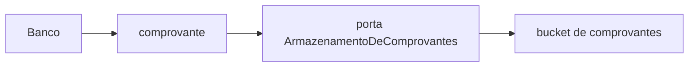

# Integrações: Flash, Omie e comprovantes

Dois sistemas de efeito (Flash, Omie) e uma porta de objeto (comprovante). Não um passo genérico chamado “Integração”.

| Sistema | Papel | Recorte | Doc |
|---|---|---|---|
| **Flash** | Provedor de benefícios (pedido, depósito, boleto, crédito no cartão) | **1** — primeiro, porque o tempo operacional está no painel | [flash.md](flash.md) |
| **Omie** | ERP financeiro (conta a pagar + rateio por departamento) | **2** — mock; 8 lançamentos já são o trecho rápido | [omie.md](omie.md) |
| **Bucket de comprovantes** | Armazenamento de comprovantes (gravar, ler, expirar o PDF/imagem do boleto pago) | Depois de **autorizado a pagar**. Adaptadores: Amazon S3 **ou** DigitalOcean Spaces — **não** escolher | [comprovantes.md](comprovantes.md) |

Log do que foi pesquisado, com confiança e perguntas abertas: [pesquisa.md](pesquisa.md).

Fontes canônicas (não inventar endpoint fora delas):

- Flash: [Manual de Integração da API Flash 2.0](https://docs.api.flashapp.services/Geral/Introducao)
- Omie: [Portal do Desenvolvedor](https://developer.omie.com.br/)

## Priorização

1. **Flash primeiro.** o financeiro declarou o gargalo: lançar pessoa a pessoa no painel Flash, não os 8 lançamentos no ERP. Recorte 1 = **calendário nacional automático** + cálculo + conferência + execução no Flash — para a célula mensal de dias úteis (hoje preenchida na mão, fato F30) e a digitação no painel.
2. **Omie depois.** Recorte 1 não implementa cliente Omie. O passo Omie no ciclo é mock / lançamento manual igual ao consolidado de pagamento. Recorte 2 amarra conta a pagar + rateio ao pedido Flash já conferido.

## Como isto mapeia o ciclo do mês

Ordem canônica (nunca “Integração” sozinho):

**Confirmar benefício → Flash → Boleto → Omie → Diretores → Banco**

| Passo | Quem | O que confirma ou faz |
|---|---|---|
| 1. Confirmar benefício | Financeiro | Conferência das linhas do lote (crédito ao colaborador) antes de chamar o Flash |
| 2. Flash | Sistema + financeiro dispara | Resumo da parcial; pedido, depósitos, confirmação. **Confirmar envio ao Flash**. Sem espera de boleto nesta etapa |
| 3. Boleto | Financeiro | **Espera do retorno** deste pedido (taxa + boleto) **antes** de Omie. Canal: `consultar_pedido` (Buscar Pedido) — poll automático (D28) e **Atualizar retorno** (D29). **Baixar boleto** quando o instrumento volta |
| 4. Omie | Financeiro (manual no recorte 1; porta no recorte 2) | Conta a pagar rateada nos 8 departamentos |
| 5. Diretores | Dois oks | **Pagamento** (não o crédito no cartão). Copy: *O crédito no Flash aprovado. Favor verificar e aprovar o pagamento.* |
| 6. Banco | Desembolso | Um recolhível por boleto; **Baixar** no chrome do iframe; **Anexar comprovante** (PDF/imagem). Conferência lê o objeto no bucket, não o e-mail. |

Adaptadores do bucket (S3 e Spaces, sem escolha): [comprovantes.md](comprovantes.md). Contrato: [SRD-01](../srd/SRD-01-contratos-de-capacidade.md#mapeamento-produto--porta).

Diretores não entram no passo Flash. Recusa de diretor não desfaz pedido confirmado.

Contrato: [PRD-02](../prd/PRD-02-operacao-do-lote.md) (Flash), [PRD-03](../prd/PRD-03-financeiro-e-governanca.md) (Omie + governança + comprovante), [PRD-04](../prd/PRD-04-carga-da-planilha.md) (carga da planilha de controle — não é passo do pipeline), [SRD-01](../srd/SRD-01-contratos-de-capacidade.md#mapeamento-produto--porta) (tabela produto ↔ porta).

## Política de entrega

Comum ao Flash (recorte 1) e ao Omie (recorte 2 / mock). **Não** é passo do pipeline, **não** é sexta porta.

Espera progressiva (exponencial com jitter) nas falhas transitórias; `400` de negócio não espera; depois de N tentativas → **fila de não processados**. Operador vê e retenta na **Observância da integração** (copy: **Não processados**). Chave de idempotência do SRD permanece — retentar não duplica depósito nem lançamento.

- Flash: [flash.md](flash.md) §10 (onde a espera para e a fila começa; motivos distintos para depósito vs confirmar).
- Omie: [omie.md](omie.md) (parágrafo curto, mesmo padrão).
- Contrato: [SRD-01 §6.1](../srd/SRD-01-contratos-de-capacidade.md) · [SRD-02 §3.1](../srd/SRD-02-qualidade-risco-e-medicao.md).
- Log do que **não** veio do manual Flash: [pesquisa.md](pesquisa.md).

## Nota para o protótipo

`proto/backoffice` já usa o pipeline **Confirmar benefício → Flash → Boleto → Omie → Diretores → Banco** (rótulos Flash / Omie; Omie é mock — **sem** “recorte 2” na UI). Em Beneficiários: **Trazer da planilha**, **Gerar planilha** — carga, não “Integração”. Imagem é adaptador, não botão. Em Banco: um recolhível por boleto, **Baixar** no iframe, **Anexar comprovante** (objeto no bucket de comprovantes). Cifras da tabela vêm da semente documentada ([proto-semente.md](../proto-semente.md)), não da entrevista. Qualquer redesign posterior mantém esses nomes.
