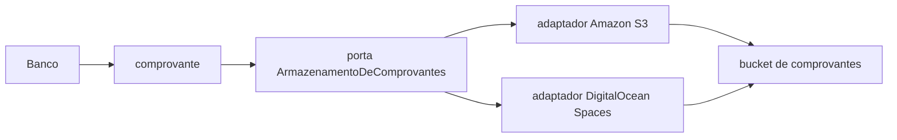

# Comprovantes — bucket (adaptadores, sem escolha)

Isto **não** escolhe stack. A porta do produto é **armazenamento de comprovantes** (`ArmazenamentoDeComprovantes`): gravar, ler, expirar. Hospedagem lógica: **bucket de comprovantes**. Contrato: [SRD-01 §5.6](../srd/SRD-01-contratos-de-capacidade.md). Comportamento: [PRD-03](../prd/PRD-03-financeiro-e-governanca.md) (decisão D21).

Não inventar conta Amazon, região, Access Key nem Spaces ID. Os dois sistemas abaixo são **adaptadores válidos da mesma porta**. O recorte desenha os dois e **não** escolhe.

## Mapeamento produto ↔ porta ↔ adaptador

Mesmo estilo da tabela Flash / Omie: o produto fala a porta; o sistema atual satisfaz.

| Nome de produto | Porta lógica | Sistema atual possível | Papel |
|---|---|---|---|
| Armazenamento de comprovantes | `ArmazenamentoDeComprovantes` | Amazon S3 | Adaptador válido (objeto no bucket) |
| Armazenamento de comprovantes | `ArmazenamentoDeComprovantes` | DigitalOcean Spaces (compatível S3) | Adaptador válido (mesmo contrato de objeto) |
| Armazenamento de comprovantes | `ArmazenamentoDeComprovantes` | equivalente de objeto | Adaptador válido se gravar / ler / expirar com id opaco |

Trocar S3 por Spaces (ou o contrário) **não** muda o PRD nem a UI. Muda só o adaptador.

| Verbo de produto | Operação | O que o adaptador faz | O que **não** vaza |
|---|---|---|---|
| gravar comprovante | `gravar` | Coloca o PDF/imagem no bucket; devolve id opaco + caminho organizacional | Conta de nuvem, chave, região |
| ler comprovante | `ler` | Devolve nome, momento, **onde**, conteúdo para **abrir** | URL assinada crua na camada do cliente |
| expirar comprovante | `expirar` | Aplica retenção (prazo = pendência P30) | Apagar auditoria |

## Onde o objeto vive (copy de conferência)

Não é e-mail. Não é MIA / Sales / Iago.

Exemplo de **onde** (caminho organizacional — competência + nome; consolidado_id é interno, não copy):

- bucket: `bucket de comprovantes`
- caminho: `morada/beneficios/2026-09/comprovante-banco.pdf`

## Fluxo

Diagrama lógico (sem vendor) também em [SRD-01](../srd/SRD-01-contratos-de-capacidade.md#mapeamento-produto--porta).

**Banco → comprovante → porta → bucket.** Os adaptadores ficam **atrás** da porta.

Isolamento (quem avalia a dinâmica, fato F40 / D04): o bucket é da observância interna. Não compartilha destino de falha com a camada do cliente.

## Distinções

| Isto | Não é |
|---|---|
| Comprovante do **pagamento** do boleto | Boleto gerado pelo Flash na confirmação |
| Porta `ArmazenamentoDeComprovantes` | `anexar_documento_de_pagamento` em `SistemaFinanceiro` (vínculo do boleto no ERP) |
| Bucket de comprovantes | Caixa de entrada dos diretores |
| Dois adaptadores válidos | “Escolhemos AWS” |

## O que isto não é

- Conta, região, SDK ou nome de bucket de fornecedor.
- Política de entrega Flash/Omie (espera progressiva / fila). Esta porta não credita nem lança.
- Passo extra no pipeline. Continua etapa **6. Banco**.
