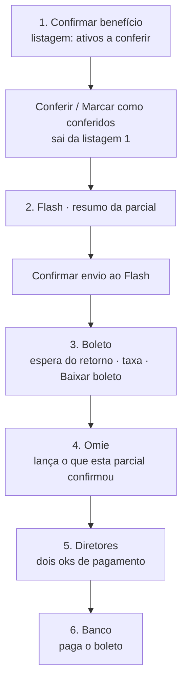
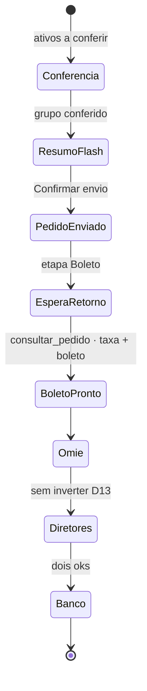

# PRD-02 — Operação do lote

Status: vigente (contrato do desafio)
Fonte: [PRD-01](PRD-01-politica-de-beneficios.md), [docs/discovery/fatos-hipoteses.md](../discovery/fatos-hipoteses.md)
Recorte 1: este é o coração da primeira entrega (**calendário nacional automático** + cálculo + conferência + execução no **Flash**). Omie é recorte 2 / mock — não esconder o nome atrás de “integração”.

## 1. Problema

Hoje o “lote” é a planilha mais a memória de quem digita no Flash. Dias úteis são contados à mão. Não há congelamento: uma célula pode mudar depois de já ter sido lançada. Não há execução como capacidade — há dezenas de digitações (~73 colaboradores, cada um com uma ou mais modalidades). Reversão, se existe, não é um estado do lote.

## 2. Usuários e trabalho a ser feito

| Papel | Trabalho a ser feito | Fora deste PRD |
|---|---|---|
| Operador financeiro | Gerar, conferir e executar um lote da competência | Digitar no painel no caminho feliz |
| Sistema (porta provedor) | Criar pedido, adicionar depósitos, confirmar | Escolher fornecedor |
| Diretor | Ver totais do lote conferido | Editar linha |

## 3. Comportamento

### 3.1 Calendário e fórmulas

**Hoje (fato F30):** o financeiro preenche dias úteis **manualmente** na planilha, com feriados nacionais. **Multibenefícios** = valor diário × essa contagem.

**Solução no recorte 1:** os dias úteis da competência vêm do calendário nacional na geração do lote — **não** é campo livre mensal, **não** é célula que o operador preenche **no sistema**. A planilha pode continuar sendo preenchida (decisão D15, [PRD-04](PRD-04-carga-da-planilha.md)): o sistema **lê** para pré-preencher; se vier coluna de dias, **compara** com o calendário e mostra divergência — a célula não escreve esse número. **Gerar planilha** é exportação (D11), não sync. O operador valida os dias úteis **clicando na competência**: o calendário do mês pinta os dias úteis nacionais; se a planilha divergir, os dois números aparecem na mesma vista. Trocar o mês continua nas setas ‹ › — o calendário não é seletor de competência.

**Calendário oficial (premissa sobre feriado municipal, pendência P12):** dia útil = dia que não é sábado, domingo nem feriado **nacional** (como o financeiro já conta hoje). Até fechar se municipal, facultativo ou recesso Morada entram, a porta não inventa feriado de cidade.

Fórmulas (valores em centavos no contrato de sistema; aqui em unidades de dinheiro):

```
CLT Multibenefícios (padrão; hipótese de SKU **a confirmar** na 2ª linha): valor diário do cadastro × dias úteis da competência (calendário nacional)
CLT Auxílio gasolina (escolha; hipótese Auxílio Mobilidade **a confirmar**): valor da faixa no cadastro (não usa dias úteis)
CLT Cartão de ônibus (escolha; D19 depósito Flash; hipótese Vale-transporte **a confirmar**): valor mensal do cadastro (não usa dias úteis)
PJ Flexível (hipótese de SKU **a confirmar**):         valor mensal do cadastro
```

Os valores do cadastro (diário, faixas, Flexível) ainda não foram informados (pendências P01, P02, P05). Linha sem valor → exceção, não chute.

### 3.2 Data de corte e geração

Data de corte ainda não foi fechada (pendência P08). Premissa do recorte 1: corte em 5 dias úteis antes do início da competência, configurável. A mesma pendência também pede a data de crédito desejada.

Na geração:

1. Lista **elegíveis ativos na empresa** (PRD-01 / premissa sobre admissão e desligamento no meio do mês — pendências P09 e P10). **Desligada, inativa ou após o corte não entra como linha de Beneficiários.**
2. Aplica fórmulas.
3. Agrega totais por modalidade e por departamento.
4. Entra em rascunho. Operador pode regenerar enquanto for rascunho.

Ao enviar para conferência, o lote **congela**: vira a fonte da verdade. Regenerar exige voltar a rascunho (evento), não substituir em silêncio.

### 3.3 Conferência linha a linha

A tabela **Beneficiários** (listagem 1 / etapa **Confirmar benefício**) lista **só colaboradores ativos na empresa** que **ainda não entraram na parcial Flash desta competência** — **ativos a conferir**. **Uma linha por colaborador**. Quem o operador **Confere** ou **Marca como conferidos** (D24) **sai desta tabela** e passa a viver no accordion da etapa Flash; **não** permanece como linha **conferida** na primeira listagem. Colaborador **desligado** (seed do proto) **não aparece**. Flash, Omie e as demais etapas do wizard só mostram quem anda nesta caminhada entre as **conferidas ativas**.

Cada linha mostra: colaborador, departamento, regime, modalidade, dias (se a fórmula usa), valor, **situação**. Pipeline **Confirmar benefício → Flash → …** vive no cabeçalho do ciclo, não na situação da linha. **“A informar”** é valor (cadastro sem R$), não situação.

**Situação** — só o que a entrevista sustentou como conferência humana. A sala **não** nomeou um zoo de estados.

| | Enunciado |
|---|---|
| **fato** | Eleno falou em **“um confere”**, **conferências** e **confirmação dos dados** trazidos pelo processamento, no primeiro momento (F45, 00:14:44). Quem avalia a dinâmica ancorou automação ao nível de confiança — **não** a um enum de tela. O financeiro **não** nomeou situações de linha. |
| **hipótese** | Depois de evidência, parte do lote poderia correr sem clicar Conferir (95% da fala F45). |
| **decisão D23** | Recorte 1: enum = **`a conferir`** \| **`conferida`**. Todo benefício começa **a conferir** e **só o operador** marca **conferida**. Editar o benefício preenchido **não** confere sozinho. Sem **conferida (automática)**, **conferida (manual)**, **conferida (com correção)**, **dias úteis divergem do calendário**, **nome no provedor a confirmar**. |

| Situação | Quando |
|---|---|
| **a conferir** | Ainda não confirmado pelo operador. Sem subtítulo de motivo na lista. |
| **conferida** | Operador confirmou o benefício preenchido (detalhe ou lote). |

Uma ação na linha, **depois de Situação**, abre o **detalhe** daquele benefício no mês (**Detalhes** visível na linha, também em hover). Lá o operador **edita** (escolha, faixa, valor). **Fechar** guarda a edição; a situação **permanece a conferir**. **Conferir** no detalhe marca **conferida**, tira a pessoa da listagem 1 e **abre o resumo Flash** (D24). O envio ao provedor é o segundo clique, na etapa 2.

Em lote, acima da tabela: a barra **só aparece com ao menos um colaborador selecionado**. **Selecionar visíveis** à esquerda e **um** botão de ação: **Marcar como conferidos** (title/subtítulo: **Marca conferido e abre o resumo Flash**). Só se o benefício está preenchido (valor não é **a informar**). Resultado: **conferida**, sai da listagem 1, grupo no resumo Flash. **Não** há segundo botão na barra. **Confirmar envio ao Flash** vive na etapa 2. **Não** há **Lançar no Omie** na barra — Omie é etapa 4 do wizard, não ação de lote. O lote **não** é outro processo: é acelerador do mesmo ciclo 1-a-1.

**D20 — payload do wizard:** só **conferidas** (operador confirmou) avançam. **A conferir** permanece na lista Beneficiários e **não** entra no pedido Flash, na espera do retorno, no Omie, nos diretores nem no banco. **Conferida** desta parcial **não** volta à tabela da etapa 1 — o lugar dela é o wizard Flash. O 95% da sala (F45) **não** é esta regra nem vira situação **conferida (automática)**.

**D24 — dois tempos:** (1) conferir (1-a-1 ou N na barra) **abre o resumo Flash** desta parcial; (2) **Confirmar envio ao Flash** dispara o provedor. Essas pessoas **desaparecem da listagem 1** no primeiro tempo. D20 continua verdadeiro: só conferidas andam.

Cada **Conferir** / **Marcar como conferidos** grava evento de auditoria: **ator** (identidade interna do operador, não o beneficiário), **quando**, **quais beneficiários** da parcial (D25, PRD-03). A UI **não** mostra dump-list **Histórico da esteira** sob o wizard (chrome fora — recorte de UI). Toast = feedback imediato, não a trilha.

### 3.3.1 Parciais na competência (D22)

Etiqueta:

| | Enunciado |
|---|---|
| **fato** | O financeiro digitava **pessoa a pessoa** no painel Flash (F23, F29). A entrevista **não** disse “um pedido por competência” nem “fechar o mês num único tiro”. A sala **não** disse “confirme todos e um boleto só”. O candidato **nem perguntou se existem taxas** (P11). |
| **hipótese (tempo)** | O gargalo é a digitação no painel, não o número de pedidos (F29). |
| **hipótese sua H20 (taxa)** | Conferir **todos** os que vão receber **antes** de **Confirmar envio ao Flash** → um pedido → um boleto → uma liquidação Omie, e evita taxa extra. Guia §04: **hipótese sua**, não fato. Premissa adotada: taxa por pedido/boleto existe na operação Morada — o candidato assumiu; o financeiro não disse. Fórmulas Flash soma das `fee` e Omie R$ 1,99 = **fato de documentação do provedor**. |
| **decisão D22** | Na mesma competência o financeiro **pode** fechar **várias parciais**. Cada parcial percorre o ciclo inteiro (**Confirmar benefício → Flash → Boleto → Omie → Diretores → Banco**) com um conjunto de colaboradores **ativos** e **conferidos**. **1 colaborador** selecionado = **1 parcial**. **N conferidas** em lote = **1 parcial de N** (acelerador do **mesmo** ciclo). Pendentes ficam para a próxima. Parciais anteriores **não se apagam**: pedidos, boletos, lançamentos Omie, autorizações e comprovantes **acumulam**. Banco lista **todas** as parciais do mês. A listagem Flash desta caminhada mostra **só quem entra nesta parcial**. O sistema **permite** 1-a-1 / bulk. O caminho feliz **recomenda / incentiva** conferir o conjunto do mês (ou o que vai receber) **antes** do envio, para não partir o mês em N boletos. H20 **não** mata D22. |

O lote congelado continua **um** por competência (verdade das linhas). Parcial **não** é segundo lote: é um recorte de execução. A chave `(competencia, colaborador, modalidade)` impede o mesmo par em duas parciais. **N pedidos = N instrumentos**; a taxa visível **soma por pedido**. Partir o mês em N boletos soma N vezes a parcela Flash daquele pedido + Omie R$ 1,99 × N (H20; P11 ainda abre se isso acontece na Morada).

**Pendência P31 (abaixo do recorte 1):** a entrevista **não** perguntou se o financeiro fecha o mês em parciais nem se os dados de uma parcial **mudam depois**. D22 não vira fato.

**D26 — grupo espera:** a parcial **não parte no meio da etapa**. Quem passou da etapa 1 está na 2 até **Confirmar envio**; depois o mesmo grupo espera o retorno na etapa Boleto; Omie, diretores e banco operam esse conjunto. Outra parcial = outro grupo (D22).

### 3.3.2 Chrome da esteira (wizard)

A barra **Confirmar benefício → Flash → Boleto → Omie → Diretores → Banco** não pinta “já visitei”. **Verde (feito / ✓) = a competência em vista não tem pendência** — nenhum passo a ser feito. Não é “passo já visitado”.

Pendência (nenhuma aba verde enquanto restar qualquer uma):

- linha **a conferir**;
- conferida ainda não enviada ao Flash;
- espera do boleto / retorno Flash;
- Omie desta parcial;
- oks dos diretores;
- comprovante do boleto.

Com pendência: etapa atual = **azul**; as outras = **neutras** (número, nunca ✓). **Confirmar benefício** com N **a conferir** **não** fica verde — o contador amarelo permanece. Setas ‹ › inalteradas.

Só quando a esteira da competência está limpa as abas não atuais podem ser verdes.

Taxa visível nas etapas **Boleto** (retorno) e **Diretores** (**decisão de recorte**, não cifra da entrevista): chrome = campo **Taxa do provedor** **dentro do slip** (exemplo `(R$ 1,00 + R$ 1,99) R$ 2,99`). Sem faixa solta. Sem linha de fórmula. `par-…` no título do recolhível e no campo Parcial do slip. Fórmula (contrato) em [PRD-03 § 3.1](PRD-03-financeiro-e-governanca.md).

Etiquetas: fórmula Flash = **fato da API** (`fee` / `totalFee` / `depositFees`; GET **não** executado). R$ 1,00 no proto = **PREMISSA DE PROTÓTIPO** (simula o retorno do pedido), não fato da entrevista. Omie R$ 1,99 = **fato da nota** Omie.CASH Completa. Soma = **decisão**. Quem paga, se a taxa existe na operação Morada, e se N boletos = N taxas = **pendência P11** (a entrevista **não perguntou**). **H20** (hipótese sua) assume que fatiar o mês soma taxa extra. Principal da política **não** dilui a taxa. Semente de benefício **não** entra nesta taxa.

### 3.4 Execução no Flash

A listagem da etapa Flash é **resumo da parcial**: departamentos recolhíveis; ao abrir, **uma linha por colaborador** que vai **nesta parcial** (CLT: escolha + Multibenefícios discriminados e a soma; PJ: Flexível). Sem tabela residual de quem permanece em Beneficiários. O grupo **espera** aqui até **Confirmar envio ao Flash** (D24, D26). Ok de diretor **não** entra nessa guarda (decisão D13): é aprovação de **pagamento**, depois do boleto (PRD-03).

O payload enviado é só linhas **conferidas** **desta parcial**, ainda não processadas no Flash nesta competência — decisões D20, D22 e D23. **A conferir** fica na lista Beneficiários e **não** aparece na etapa Flash. Já enviado nesta competência (outra parcial) não reaparece neste pedido.

Sequência de negócio na porta do provedor de benefícios (sistema atual: **Flash**; ver `docs/integracoes/flash.md`):

1. Criar pedido **desta parcial** (a competência admite vários — D22).
2. Adicionar um depósito por linha (colaborador + modalidade + valor principal).
3. Respeitar restrição do provedor atual: **no máximo 1 depósito por colaborador+benefício por pedido**. Correção = cancelar depósito e adicionar de novo, **antes** de confirmar.
4. Confirmar pedido (data de crédito, pagamento). Pedido confirmado **não aceita alteração**.
5. Valores em **centavos**. Depósito abaixo do mínimo do provedor (hoje equivalente a R$ 2,00) é exceção de conferência, não tentativa cega.

Falha transitória na porta (`409`, `422` já faturado, `5xx`, timeout) segue **espera progressiva** até N; `400` de negócio não espera. Esgotou (ou recusa permanente) → **fila de não processados**, visível na **Observância da integração** (copy: **Não processados**). Retentar **não** duplica depósito: chave `(competencia, colaborador, modalidade)`. Pedido confirmado é imutável — falha de confirmar e falha de depósito são motivos distintos na fila. Detalhe: `docs/integracoes/flash.md`.

Taxa visível: tabela em [§ 3.3.2](#332-chrome-da-esteira-wizard) e [PRD-03](PRD-03-financeiro-e-governanca.md). Não diluir Omie dentro de Flash.

Estados de execução, em português: em execução → conciliado, ou falhou, ou revertido.

### 3.5 Reversão

Reversão é operação explícita sobre lote ou linha, com motivo, ator e recorte (pedido inteiro vs depósito ainda cancelável).

- Antes da confirmação do pedido: cancelar depósitos/pedido no provedor; lote pode voltar a conferência.
- Depois da confirmação e antes do crédito disponível: tentar cancelar o pedido; se o provedor recusar, o lote fica **falhou**, com pendência humana.
- Depois do crédito: recorte 1 **não** estorna sozinho (desligamento após crédito e estorno — pendências P10 e P24). Lote marcado **revertido** só após compensação acordada.

## 4. Jornadas

### 4.1 Caminho feliz mensal (aceito)

**Aceito (recomendado, H20):** conferir o **conjunto** dos que vão receber **antes** de **Confirmar envio ao Flash** — um pedido → um boleto → uma liquidação Omie. Parciais 1-a-1 / bulk **continuam possíveis** (D22); não são o caminho para evitar taxa extra. A parcial é um **grupo**. Confirmar benefício → **resumo Flash** → **Confirmar envio** → **espera do retorno** (taxa + boleto) → Omie → dois diretores autorizam o **pagamento** → Banco paga o boleto. Flash **não** espera diretor (D13). Recusa de pagamento **não** desfaz o pedido confirmado.

**Espera do retorno (D27) permanece.** Depois de enviar ao Flash, o financeiro espera taxa + boleto **antes** de Omie. Isso é o desenho da etapa **Boleto** — ideia do candidato, não invalidada.

**Canal ≠ desenho.** Webhook era o mecanismo imaginado (H19). **Fato de documentação Flash (F49, não da entrevista):** o manual 2.0 não publica webhook; Confirmar Pedido manda acompanhar via Buscar Pedido. A porta `consultar_pedido` cobre essa espera (D28). Escrever “sem webhook” como rejeição do desenho é erro de etiqueta. Chrome: **espera do retorno deste pedido** (o operador não vê o canal). Diagrama canónico abaixo (também em [proposta](../entrega/proposta-product-engineer.md)).





1. Chega a data de corte. Operador gera o lote (dias úteis já calculados). Só **ativos na empresa** entram em Beneficiários.
2. Confere o que está **a conferir**. Nada vira **conferida** sozinho. **Conferir / Marcar como conferidos** marca conferida, **sai da tabela Beneficiários** e leva o grupo ao **resumo Flash** (D24). Pendentes (**a conferir**) ficam na lista.
3. O grupo espera na etapa Flash. **Confirmar envio ao Flash** dispara o provedor — **sem** ok de diretor (D13). A conferir não entra (D20, D22).
4. Etapa **Boleto** (etapa 3): o financeiro **espera o retorno deste pedido** (taxa + boleto) — D27. A porta que cobre a espera é `consultar_pedido`: poll automático (D28; hoje BuscarPedido) e disparo manual **Atualizar retorno** (D29) se a espera falha, timeout ou a tela diverge do provedor. O proto simula a espera e a taxa Flash **R$ 1,00** no retorno (**PREMISSA**); **não** inventa webhook. **Baixar boleto** só nesta etapa (e de novo no Banco). Etapa 2 (Flash) = resumo + **Confirmar envio ao Flash** — sem boleto, sem espera, sem taxa-como-arquivo.
5. **Omie** lança o que esta parcial confirmou. **Diretores** autorizam o pagamento (dois oks). **Banco** paga o boleto. Parciais anteriores permanecem; Banco lista **todas**.
6. Crédito ocorre na data informada (não fim de semana/feriado — restrição do provedor atual).

### 4.2 Feriado contado errado (dias úteis manuais vs calendário — hipótese H05)

1. Calendário oficial traz 21 dias; operador lembra de um ponto facultativo local.
2. **Não** edita a fórmula na mão para “dar certo”. Abre exceção de feriado municipal (pendência P12): ou aceita o nacional, ou registra ajuste justificado na linha/competência.
3. O ajuste vira evento. Próximo ciclo pergunta se municipal entra no calendário.

### 4.3 Valor digitado errado no passado, agora conferido

1. Linha vem com valor do cadastro. Operador compara com a planilha antiga.
2. Se a planilha estava certa e o cadastro errado, corrige o **perfil** e regenera só se ainda for rascunho; se congelado, corrige a linha com motivo “cadastro”.
3. Não corrige “só no Flash”.

### 4.4 Falha no meio dos depósitos

1. 40 depósitos entram, o 41º é recusado (duplicidade colaborador+benefício, benefício inativo, etc.).
2. Lote permanece **em execução** até compensar: cancelar o depósito ruim ou o pedido, nunca confirmar um pedido incompleto em silêncio.
3. Se confirmar incompleto for impossível de evitar, estado **falhou** e lista do que foi / não foi ao provedor.

## 5. Critérios de aceite

- Dado uma competência, quando o lote é gerado, então os dias úteis da competência vêm do calendário nacional e não de campo livre obrigatório.
- Dado que hoje o financeiro preenche dias úteis na planilha (fato F30), quando o recorte 1 opera, então o operador **não** digita os dias úteis da competência; o motor lê o calendário.
- Dado feriado nacional no mês, quando **Multibenefícios** é calculado, então esse dia não multiplica o valor diário.
- Dado lote em rascunho, quando o operador regenera, então as linhas anteriores são substituídas e o fato é registrado.
- Dado lote em conferência, quando o operador corrige uma linha, então o total muda só por essa correção e o lote não “descongela” inteiro.
- Dado lote com linhas **conferidas** candidatas a depósito (decisão D20), quando a execução roda, então o provedor recebe só essas linhas, no máximo um depósito por par colaborador+modalidade naquele pedido.
- Dado pedido confirmado no provedor, quando alguém tenta alterar depósito, então a operação é recusada; o caminho é reversão/novo lote.
- Dado valor em reais no cadastro, quando o depósito é enviado, então a quantia está em centavos.
- Dado que ainda existe linha **a conferir** candidata a depósito (decisão D20), quando o operador dispara o Flash, então essa linha **não** entra no pedido e permanece na lista Beneficiários; as **conferidas** entram no Flash e **saem** da listagem 1. Cartão de ônibus **é** candidato (D19). Não se manda **a conferir** para desbloquear o mês.
- Dado uma linha **a conferir**, quando a tabela renderiza, então a situação é só **a conferir** — sem subtítulo de motivo, sem “planilha 22”, sem “no provedor a confirmar”.
- Dado o operador abrir o detalhe, editar e **Fechar**, quando a lista renderiza, então a edição está guardada e a situação permanece **a conferir**. **Detalhes** permanece visível na linha (também em hover).
- Dado valor **a informar**, quando o operador tenta conferir, então a linha permanece **a conferir** até preencher.
- Dado admissão após o corte (premissa sobre o meio do mês, pendência P09), quando o lote executa, então essa pessoa não recebe depósito nessa competência.
- Dado colaborador **desligado, inativo ou após o corte**, quando Beneficiários renderiza, então essa pessoa **não** aparece. Flash/Omie só listam quem anda no wizard entre as conferidas **ativas**.
- Dado um colaborador ativo **a conferir** com benefício preenchido, quando o operador **Confere** no detalhe, então a linha vira **conferida**, nasce **uma parcial só com ele**, **essa pessoa desaparece da tabela Beneficiários** e a etapa Flash mostra o **resumo** — ainda **sem** pedido no provedor; os demais **a conferir** permanecem para a próxima.
- Dado N selecionados preenchidos, quando o operador clica **Marcar como conferidos**, então as linhas viram **conferida**, nascem no **resumo Flash** como **uma parcial de N** e **saem da listagem 1**. O envio ao provedor espera **Confirmar envio ao Flash**. Não há segundo botão na barra de Beneficiários.
- Dado o grupo no resumo Flash, quando o operador clica **Confirmar envio ao Flash**, então o provedor recebe essa parcial e a etapa **Boleto** mostra **espera do retorno deste pedido** (D27). Copy = a espera, não o nome do canal. A etapa Flash **não** mostra **Baixar boleto**.
- Dado a espera automática falhou, esgotou ou o estado da tela diverge do pedido, quando o operador clica **Atualizar retorno** na etapa Boleto, então o sistema dispara a mesma `consultar_pedido` (D29) e atualiza taxa e boleto.
- Dado o retorno do pedido no proto, quando a etapa Boleto renderiza, então a taxa Flash de exemplo é **R$ 1,00** (**PREMISSA DE PROTÓTIPO**), **Baixar boleto** fica no cabeçalho e no chrome do iframe, e a taxa visível é o campo **Taxa do provedor** no slip (exemplo `(R$ 1,00 + R$ 1,99) R$ 2,99`) — sem faixa solta, sem linha de fórmula.
- Dado a barra de lote com seleção, quando renderiza, então o único botão de ação é **Marcar como conferidos**. **Lançar no Omie** não aparece na barra.
- Dado uma parcial já com pedido, quando outra começa, então pedido, boleto, lançamento Omie, autorizações e comprovante da primeira **permanecem**.
- Dado duas parciais na competência, quando o operador abre Banco, então há **um recolhível por boleto** das duas.
- Dado N parciais na competência, quando a taxa visível renderiza em cada uma, então cada pedido soma a própria parcela Flash (`totalFee` daquele pedido) + Omie R$ 1,99 × boleto daquela parcial — **N pedidos = N instrumentos = N somas** (invariante; H20 recomenda minimizar N). O sistema **não** bloqueia a segunda parcial.
- Dado o conjunto do mês ainda **a conferir**, quando o operador está no resumo Flash com só parte conferida, então **Confirmar envio ao Flash** **permanece permitido** (D22); o caminho feliz **recomenda** conferir quem vai receber antes do envio (H20) — não é trava.
- Dado taxa visível na etapa Diretores, quando o boleto recolhido abre, então a taxa é o **mesmo campo do slip** da etapa Boleto: **Taxa do provedor** (exemplo `(R$ 1,00 + R$ 1,99) R$ 2,99`). Sem faixa duplicada. Sem linha de fórmula na tela. Sem esconder Omie dentro de Flash. Sem “a informar” por falta de % Flash — a parcela Flash usa `totalFee` (R$ 1,00 no proto = **PREMISSA DE PROTÓTIPO**, GET `depositFees` não executado). Fórmula no contrato: [PRD-03](PRD-03-financeiro-e-governanca.md).
- Dado ao menos uma linha **a conferir** (ou Flash não enviado, espera de boleto, Omie, oks de diretor ou comprovante ausente), quando o wizard renderiza, então **nenhuma** aba está verde nem com ✓ — inclusive **Confirmar benefício** com o contador amarelo. A etapa atual é azul; as outras são neutras.
- Dado a competência sem trabalho restante, quando o wizard renderiza, então as abas não atuais podem ser verdes; verde **não** significa “já visitei o passo”.

## 6. Fora de escopo

- Automação do lançamento **Omie** (PRD-03 / recorte 2; no recorte 1 o passo Omie é mock / manual).
- Aprovação estruturada na UI dos diretores (recorte posterior); recorte 1 exige consolidado de pagamento identificável mesmo se o ok ainda for e-mail.
- Recarga inteligente / saldo residual de cartão (não foi dor do financeiro).
- Escolha de protocolo ou broker de fila. A **política** (espera progressiva + fila de não processados) está no contrato; o produto de fila não.

## 7. Premissas e pendências

| ID | Premissa adotada | Quem confirma |
|---|---|---|
| P08 | Corte = 5 dias úteis antes do início da competência (o lote antecipa o mês — decisão D10, a confirmar) | Calendário do financeiro |
| P09, P10 | Ativos no corte; sem pró-rata (antecipação, decisão D10) | RH |
| P12 | Só feriados nacionais no recorte 1 | Política interna |
| P11 | A entrevista **não perguntou** se há taxa. Aberto: (1) existe taxa Flash/Omie na operação Morada? (2) quem paga e se entra no ERP? (3) N boletos = N taxas? Fórmulas Flash `totalFee` + Omie R$ 1,99 = **fato de documentação do provedor**, não da sala. Contrato = tabela Flash \| Omie \| visível **por pedido**. R$ 1,00 Flash no proto = PREMISSA DE PROTÓTIPO. H20 assume (1) e (3) = sim. | Notas oficiais + um ciclo real |
| P31 | Entrevista não perguntou parciais nem se os dados mudam depois. D22 segue decisão | Próxima conversa com o financeiro (abaixo do recorte 1) |
| P24 | Sem estorno automático pós-crédito no recorte 1 | RH + financeiro |
| P16 | Meio de pagamento = o que o pedido atual já usa | Um pedido atual |
| D11 | Planilha gerada pelo backoffice se ainda for útil; perfil escreve (destino) | Grill Q3 (não perguntado na sala) |
| D15 | Carga unidirecional planilha → sistema (arquivo ou imagem); calendário manda em dias; sync depois | [PRD-04](PRD-04-carga-da-planilha.md) |
| D20 | Wizard só encaminha **conferidas**; **a conferir** fica na lista Beneficiários (etapa 1). Conferidas da parcial **saem** dessa tabela. Conferir **abre o resumo Flash**; **Confirmar envio** dispara o provedor (D24). | Invariante do lote |
| D22 | Várias **parciais** na competência **permanecem possíveis** (1-a-1 / bulk); lote é acelerador; histórico acumula. Caminho feliz **recomenda** conferir o conjunto antes do envio (H20) — não trava. | Recorte |
| D23 | Situação = **a conferir** \| **conferida**. Sem automática / correção / catálogo / divergência de calendário como situação. Editar não confere | Recorte; entrevista só falou em confere / conferência |
| D24 | **Marcar como conferidos** / **Conferir** = abre o resumo Flash. **Confirmar envio ao Flash** dispara o provedor. Sem Omie na barra de Beneficiários | Recorte de chrome; não é fato da entrevista |
| D25 | Eventos `conferiu` e `anexou comprovante` existem (ator = identidade interna). Sem card dump-list sob o wizard (recorte de UI). Banco: **Quem anexou** no arquivo. Entrevista não pediu o card | Recorte de observabilidade / UI |
| D26 | A parcial **caminha junta**; não parte o grupo no meio da etapa | Recorte de caminho; não é fato da entrevista |
| D27 | Etapa **Boleto** = espera do retorno (taxa + boleto) antes de Omie. Ideia do candidato; não invalidada | Desenho de produto |
| D28 | Canal da espera = `consultar_pedido` (poll automático; provedor atual sem webhook publicado). Não substitui D27 | Adaptação de porta; não consulta de produto |
| D29 | Operador dispara a mesma `consultar_pedido` na etapa 3 (**Atualizar retorno**) se a espera falha, timeout ou a tela diverge | Pedido de produto |

## 8. Sucesso

- Tempo operador: conferir + executar << tempo atual de digitação no painel (baseline no 1º ciclo).
- 95% da sala (F45) **não** vira situação **conferida (automática)** no recorte 1.
- Erros de dias úteis vs calendário nacional: tendência a zero depois de validar se a contagem manual errava o calendário (hipótese H05).
- Pedidos confirmados incompletos: zero no caminho controlado.
- Reversões rastreáveis: 100% com motivo.
