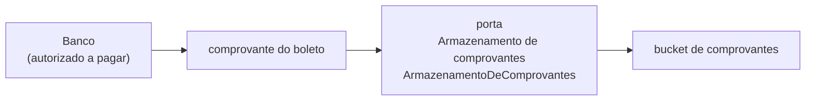

# SRD-01 — Contratos de capacidade (portas)

Status: vigente
Linguagem: operações de negócio. Sem transporte, sem framework.
Sistemas atuais satisfazem as portas; não são as portas.

Tabela canônica produto ↔ porta: [§ mapeamento](#mapeamento-produto--porta). Glossário e CONTEXT apontam para cá.

## 1. Capacidades

O produto fala com seis mundos: porta **identidade interna** (`IdentidadeInterna`) — hoje o backoffice; porta **calendário oficial** (`CalendarioOficial`) — hoje o calendário nacional; porta **provedor de benefícios** (`ProvedorDeBeneficios`) — hoje o Flash; porta **sistema financeiro** (`SistemaFinanceiro`) — hoje o Omie; porta **planilha de controle** (`PlanilhaDeControle`) — hoje o Excel que o financeiro já preenche (fato F21); porta **armazenamento de comprovantes** (`ArmazenamentoDeComprovantes`) — hoje um **bucket de comprovantes** (adaptadores possíveis: Amazon S3 ou DigitalOcean Spaces — **não** escolher neste recorte). Recorte 1 executa Flash e **lê** a planilha (arquivo ou imagem); Omie é recorte 2 / mock; comprovante é gravar/ler/expirar depois de **autorizado a pagar**. Pesquisa: `docs/integracoes/`. Imagem com extração assistida é **adaptador** da planilha, não outro produto.

### Mapeamento produto ↔ porta

Única tabela canônica. Identificadores na coluna **Porta lógica** existem para grep no contrato; **não** são copy de tela.

| Nome de produto | Porta lógica | Sistema atual | O que faz |
|---|---|---|---|
| Identidade interna | `IdentidadeInterna` | backoffice | Devolve o **perfil de identidade**: na entrevista, e-mail `@morada`, área, nível de carga. Departamento de rateio e ativo na data são contrato desejado, não campos mostrados (pendência P18; [`fontes-de-dados.md`](../discovery/fontes-de-dados.md)). |
| Calendário oficial | `CalendarioOficial` | calendário nacional | Devolve os dias úteis da competência; o operador não preenche o mês. |
| Provedor de benefícios | `ProvedorDeBeneficios` | Flash | Cria pedido, deposita, cancela, confirma e **consulta o pedido** (espera do retorno da etapa Boleto: poll automático e **Atualizar retorno**). |
| Sistema financeiro | `SistemaFinanceiro` | Omie | Registra conta a pagar rateada nos oito departamentos e reconcilia totais. |
| Planilha de controle | `PlanilhaDeControle` | Excel / ficheiro que o financeiro já preenche | Lê linhas para pré-preencher; gera arquivo de volta. Imagem da grade é adaptador da **mesma** extração, não outra porta. Sync bidirecional existe no contrato e **não** liga no recorte 1. |
| Armazenamento de comprovantes | `ArmazenamentoDeComprovantes` | Amazon S3 **ou** DigitalOcean Spaces (compatível S3) — **não** escolher no recorte | Grava, lê e expira o comprovante do boleto. Hospedagem lógica: **bucket de comprovantes**. Os dois sistemas atuais são adaptadores válidos da mesma porta. |

Não são portas (entidades no [SRD-00](SRD-00-modelo-de-dominio.md)): **lote congelado** (`LoteMensal`), **consolidado de pagamento** (`ConsolidadoDePagamento`) e **comprovante de pagamento** (`ComprovanteDePagamento`). Backoffice é habitat e adaptador da identidade interna, não uma porta. **Fonte de carga** não é nome de produto: a carga lê a planilha de controle. Extração por imagem **não** é um sétimo produto. **Bucket de comprovantes** é o destino lógico da porta, não um vendor.

**Observância da integração** (`ObservanciaDaIntegracao`) também **não** é porta nem produto extra: é a superfície do operador sobre a **política de entrega** compartilhada das portas provedor de benefícios e sistema financeiro (espera progressiva + fila de não processados). Identificador PascalCase só para grep; copy da lista: **Não processados**.

Integrações dessas portas **não** compartilham a camada do cliente. O comprovante do boleto **não** vive na camada do cliente nem como verdade no e-mail.

Adaptadores do bucket (não é escolha de recorte): [docs/integracoes/comprovantes.md](../integracoes/comprovantes.md).

## 2. Entidades que atravessam as portas

- Identidade interna (**perfil de identidade**): e-mail corporativo, área, nível de carga (fatos F38, F41). Departamento de rateio, ativo na data, nome e regime **se** a identidade já os tiver — ainda abertos (pendência P18). Não assumir escolha de transporte nem faixa nesta porta.
- Calendário oficial: competência → lista de dias úteis / feriados considerados.
- Provedor de benefícios: colaborador-no-provedor (documento), benefício/modalidade, valor em centavos, pedido, depósito, taxa, instrumento de pagamento.
- Sistema financeiro: competência, consolidado_id, 8 valores departamentais, documento de cobrança, status de pagamento.
- Planilha de controle: linhas lidas (colaborador, regime, departamento, modalidade, valores se presentes, dias se presentes), meio (arquivo | imagem), divergências vs calendário, falhas de leitura.
- Armazenamento de comprovantes: comprovante do boleto (nome, momento, **onde** = bucket + caminho + id opaco), consolidado_id, competência. Não é o boleto do provedor; não é anexo de e-mail.

O domínio mapeia modalidade da política ↔ benefício do provedor. Mapeamento inválido bloqueia a linha. Dias lidos da planilha **não** substituem `CalendarioOficial`.

## 3. Invariantes das portas

1. Nenhuma porta devolve “sucesso” sem referência correlacionável ao lote/linha.
2. Chamada repetida com a mesma chave de idempotência não duplica efeito (ver SRD-02). Retentativa da política de entrega **reusa** essa chave; não é segundo depósito nem segundo lançamento.
3. Falha da porta não altera o lote congelado; só o estado de execução/projeção. Esgotar a espera progressiva **não** some o efeito: o item vai à fila de não processados.
4. Credenciais do provedor de benefícios, do sistema financeiro e do bucket de comprovantes não vazam para a UI nem para a camada do cliente.
5. **Política de entrega** é uma só para `ProvedorDeBeneficios` e `SistemaFinanceiro`: espera progressiva nas falhas transitórias; recusa permanente não espera; depois de N tentativas (ou na primeira recusa permanente) → fila de não processados. Não nasce porta extra. `ArmazenamentoDeComprovantes` **não** entra nessa política: não credita nem lança; falha de gravar deixa o comprovante ausente, visível.

## 4. Estados

O lote (SRD-00) é o orquestrador. As portas não possuem a verdade do benefício: possuem projeções.

## 5. Portas

### 5.1 Identidade interna (`IdentidadeInterna`)

Porta **identidade interna** (`IdentidadeInterna`) — hoje o backoffice (e-mail `@morada`, área, nível de carga).

Devolve **perfil de identidade**, não **perfil de benefício**. Recorte 1 **lê** com confiança alta só o que a entrevista nomeou; regime, escolha de transporte e faixa **não** saem desta porta até P18 fechar ([`fontes-de-dados.md`](../discovery/fontes-de-dados.md)).

| Atributo | Na entrevista | Na porta |
|---|---|---|
| e-mail `@morada` | fato F38 | lê |
| área | fato F38, F41 | lê |
| nível de carga | fato F38, F41 | lê; **não** calcula benefício |
| nome, ativo na data, departamento de rateio | não listados; área ≠ departamento até o mapa | contrato desejado; hipótese até inspeção |
| regime, escolha de transporte, faixa, CPF, data de admissão | não mostrados (P18) | **não** assume |

Operações:

| Verbo de produto | Operação | Entrada de negócio | Saída |
|---|---|---|---|
| obter colaborador | `obter_colaborador` | identidade interna | perfil de identidade: e-mail, área, nível de carga; ativo e departamento **se** existirem — sem inventar |
| listar ativos na data de corte | `listar_ativos_na_data` | data de corte | conjunto de colaboradores |
| obter departamento | `obter_departamento` | colaborador | um dos 8 departamentos |

Restrições conhecidas: identidade **não** é o CPF do Flash. Nível de carga não entra no cálculo de benefício até alguém decidir o contrário (não foi fato de política). Recorte 1 não trata regime nem ônibus/carro como campos desta porta. `listar_ativos_na_data` e `obter_departamento` são contrato **desejado**: se o backoffice não devolver ativo ou departamento de rateio, a porta recusa ou devolve vazio — sem inventar; a carga da planilha cobre até P18. O ator gravado em `conferiu` / `anexou comprovante` (D25) é o perfil desta porta — não o colaborador beneficiário. A UI do recorte 1 não dumpa esses eventos sob o wizard.

### 5.2 Calendário oficial (`CalendarioOficial`)

Porta **calendário oficial** (`CalendarioOficial`) — hoje o calendário nacional (feriados nacionais + fins de semana; hoje o financeiro conta na mão — fato F30; premissa sobre feriado municipal, pendência P12). Não há sistema nomeado na entrevista.

**Recorte 1:** esta porta **está** no recorte. Os dias úteis da competência são calculados na geração do lote, calendário nacional. O operador não informa o inteiro do mês. A planilha atual deixa de ser a escritora desses dias.

Operações:

| Verbo de produto | Operação | Entrada | Saída |
|---|---|---|---|
| dias úteis da competência | `dias_uteis` | competência | inteiro e lista de datas (dias úteis da competência, calendário nacional) |
| é dia útil | `eh_dia_util` | data | sim/não |
| próxima data de crédito válida | `proxima_data_de_credito_valida` | data pretendida | data que o provedor atual aceitaria (não fim de semana/feriado) |

Restrição: municipal/facultativo/recesso = pendência P12; até lá a porta **não** inventa feriado de cidade.

### 5.3 Provedor de benefícios (`ProvedorDeBeneficios`)

Porta **provedor de benefícios** (`ProvedorDeBeneficios`) — hoje o Flash.

Operações (nível de negócio, não de transporte):

| Verbo de produto | Operação | Entrada | Saída |
|---|---|---|---|
| criar pedido | `criar_pedido` | competência, identificador interno do lote **e da parcial** (D22: várias parciais). Gatilho de produto: **Confirmar envio ao Flash** depois do resumo (D24), não o clique de conferir na lista | referência do pedido |
| adicionar depósito | `adicionar_deposito` | pedido, colaborador-no-provedor, modalidade, valor principal em centavos | referência do depósito, taxa se houver, estado criado |
| cancelar depósito | `cancelar_deposito` | pedido, depósito | depósito cancelado; libera o par colaborador+benefício naquele pedido |
| cancelar pedido | `cancelar_pedido` | pedido, motivo | pedido e depósitos cancelados, se o provedor ainda permitir |
| confirmar pedido | `confirmar_pedido` | pedido, data de crédito, meio de pagamento, responsável | pedido imutável, totais, instrumento (boleto ou equivalente), taxa total |
| consultar pedido | `consultar_pedido` | referência do pedido da parcial | estado: em montagem / confirmado / creditado / cancelado + taxa + instrumento (boleto). **Cobre a espera do retorno** da etapa **Boleto** (etapa 3, D27): taxa + boleto **antes** de Omie. **Dois gatilhos, uma operação:** (1) **automático** — poll da espera no recorte 1 (D28); (2) **manual** — operador na etapa Boleto, chrome **Atualizar retorno** (D29), quando a espera falha, timeout, ou o estado da tela diverge do provedor. Mesma porta, mesmo pedido. Não é segunda integração. Não inventa webhook. Observância pode disparar o mesmo verbo se o item estiver na fila; recorte 1: botão na etapa 3. No provedor atual mapeia para Buscar Pedido — o manual 2.0 não publica webhook (F49). Substitui o **canal** imaginado (H19), não a espera. |
| listar benefícios ativos | `listar_beneficios_ativos` | empresa | modalidades disponíveis no provedor. Recorte 1: os **slots** da operação já estão mapeados (D16: Multibenefícios + (gasolina \| ônibus) + Flexível; D19: ônibus = Flash). GET ainda precisa dos `name`/`benefitId` e das habilitadas e não recarregadas (hipótese Cultura e Saúde; 3 slots vs 4 SKUs). GET **não** foi executado. Copy do operador continua a regra da sala. Equivalente Flash (P07) **não** entra na lista Beneficiários nem no Detalhe — vive no contrato até o GET. As não recarregadas só bloqueiam depois da lista real. |

**Restrições reais já conhecidas do Flash (documentação pública do provedor; fecham a pendência de duplicidade no pedido neste contrato, não vieram da entrevista):**

1. **No máximo 1 depósito por colaborador + benefício no mesmo pedido.** Segundo depósito do mesmo par é conflito. Correção: cancelar o depósito e adicionar de novo.
2. **Valores em centavos.** Mínimo hoje equivalente a R$ 2,00 (200 centavos). Abaixo disso a porta recusa.
3. **Pedido confirmado não aceita alteração** de depósitos (nem inclusão nem remoção).
4. Taxa do provedor é variável: soma das taxas de cada depósito na confirmação **daquele pedido** (fato da API do provedor atual: `fee` / `totalFee`; `depositFees` no catálogo — GET **não** executado). **Não** é a fórmula da política Morada. **P11:** a entrevista **não perguntou** (1) se existe taxa na operação Morada, (2) quem paga, (3) se N pedidos/boletos = N taxas. A taxa **visível** ao operador = essa parcela **+** a tarifa publicada do sistema financeiro (R$ 1,99 × boletos **da parcial**; fato da nota Omie.CASH) — **por pedido**. N `criar_pedido` = N instrumentos = N somas. **H20** (hipótese sua) recomenda minimizar N; a porta **não** recusa o segundo pedido (D22). A porta do provedor **não** devolve a parcela Omie.
5. Data de crédito recusada se for fim de semana ou feriado (no provedor atual).
6. Cancelar pedido depois de creditado (`disponível`) é recusado; estorno vira processo humano (pendência P24).
7. Documento do colaborador no depósito: CPF só números — dado pessoal, ver SRD-02 (pendência P25).
8. Confirmação exige meio de pagamento e responsável administrativo (pendência P16).

O produto **não** usa o painel humano no caminho feliz. O painel permanece contingência.

### 5.4 Sistema financeiro (`SistemaFinanceiro`)

Porta **sistema financeiro** (`SistemaFinanceiro`) — hoje o Omie.

Operações:

| Verbo de produto | Operação | Entrada | Saída |
|---|---|---|---|
| incluir conta a pagar com rateio | `incluir_conta_a_pagar_com_rateio` | consolidado_id, 8 valores por departamento, documento do provedor, competência | referência dos lançamentos |
| consultar lançamentos da competência | `consultar_lancamentos_da_competencia` | competência / consolidado_id | valores por departamento e status |
| anexar documento de pagamento | `anexar_documento_de_pagamento` | lançamento, boleto ou equivalente | vínculo |

**Restrição real já conhecida:** lançamento **por departamento**, não por colaborador. São 8 linhas, não 73. Recorte 1 cumpre isso **manualmente** (mock Omie); a porta já existe no contrato para o recorte 2 não redesenhar o domínio. Sem cliente Omie neste recorte.

A porta **não** devolve campo de taxa. A parcela Omie da taxa visível vem da **nota publicada** do sistema atual (liquidação R$ 1,99 × boletos da parcial), não de `incluir_conta_a_pagar_com_rateio`. Não misturar essa cifra na taxa do provedor. **P11:** a entrevista não perguntou se essa tarifa incide na operação Morada. **H20** assume que cada boleto soma R$ 1,99 — hipótese sua, fato da nota.

Não há lançamento de folha nesta porta.

### 5.5 Planilha de controle (`PlanilhaDeControle`)

Porta **planilha de controle** (`PlanilhaDeControle`) — hoje o Excel / ficheiro que o financeiro já preenche (fatos F21, F22, F30). Não é o lote. Não é o calendário.

**Recorte 1 (decisão D15):** o hábito de preenchimento permanece. A porta **lê** para pré-preencher e **gera** arquivo se ainda precisarem do Excel. Não força abandonar a planilha no dia 1 (D11 não foi acordo da sala). Dias úteis da competência **não** saem desta porta como verdade — saem de `CalendarioOficial`; aqui só se **compara**.

Imagem da tela ou foto da grade: **adaptador** de `ler_linhas`. Mesma extração, outro meio. Não nasce porta `FonteDeCarga` nem produto “IA”.

Operações:

| Verbo de produto | Operação | Entrada de negócio | Saída |
|---|---|---|---|
| ler linhas | `ler_linhas` | competência, artefato (arquivo tabular **ou** imagem), mapa de colunas quando conhecido (pendência P29) | conjunto de linhas candidatas + falhas de leitura + coluna de dias se existir |
| gerar arquivo | `gerar_arquivo` | competência, lote ou perfil vigente | arquivo de planilha (projeção; dias = calendário) |
| sincronizar | `sincronizar` | competência, artefato vivo, lote/perfil | recorte **posterior**: dois escritores. Recorte 1: operação **existe** no contrato e a UI **não** a dispara |

Restrições conhecidas:

1. Extração pré-preenche rascunho. Não congela lote. Não dispara provedor.
2. Se `ler_linhas` trouxer dias úteis, o domínio compara com `dias_uteis` do calendário e **recusa** gravar o inteiro da planilha como verdade da competência sem divergência visível.
3. Célula ilegível, coluna fora do mapa ou imagem desfocada = falha explícita na linha ou no artefato; a porta **não** completa palpite.
4. Cartão de ônibus lido vira depósito Flash da escolha (D19). Valor ausente = “a informar”, não canal desconhecido.
5. Valor ausente não é cifra inventada.
6. `gerar_arquivo` não escreve no ficheiro que o operador tem aberto.
7. `sincronizar` no recorte 1 é recusa de produto: dois escritores reabrem o sistema-sombra (hipótese H03).

### 5.6 Armazenamento de comprovantes (`ArmazenamentoDeComprovantes`)

Porta **armazenamento de comprovantes** (`ArmazenamentoDeComprovantes`) — hoje um **bucket de comprovantes**. Sistemas atuais possíveis (adaptadores da **mesma** porta; **não** escolher neste recorte): Amazon S3 e DigitalOcean Spaces (compatível S3). Sem conta de nuvem inventada. Mapeamento: [docs/integracoes/comprovantes.md](../integracoes/comprovantes.md).

Não é a porta financeira. `anexar_documento_de_pagamento` em `SistemaFinanceiro` vincula o **boleto** ao lançamento ERP. Esta porta guarda o **comprovante do pagamento** depois de autorizado a pagar.

Operações:

| Verbo de produto | Operação | Entrada de negócio | Saída |
|---|---|---|---|
| gravar comprovante | `gravar` | consolidado_id, competência, artefato (PDF ou imagem), ator | referência opaca + **onde** (bucket de comprovantes + caminho) |
| ler comprovante | `ler` | referência opaca | objeto: nome, momento, onde; conteúdo para **abrir** |
| expirar comprovante | `expirar` | referência opaca, política de retenção | objeto expirado; auditoria permanece (pendência P30: prazo) |

Restrições conhecidas:

1. Só depois dos dois oks de pagamento sobre o consolidado vigente. Sem autorização, `gravar` recusa.
2. Id de objeto é **opaco**. Caminho organizacional (ex.: competência / consolidado / nome) não é conta de fornecedor.
3. O e-mail **não** é origem da verdade do arquivo. Isolado da camada do cliente (D04).
4. `ler` não publica o objeto em produto de cliente.
5. `expirar` não apaga a trilha de quem gravou/leu. Prazo = P30.
6. Amazon S3 e DigitalOcean Spaces satisfazem a porta da mesma forma. Trocar adaptador **não** muda o contrato.

## 6. Qualidade na borda

- Timeout, recusa e resposta parcial da porta não confirmam lote.
- Mapeamento colaborador interno ↔ colaborador no provedor é explícito; falha de mapeamento = exceção de conferência, não depósito no nome errado.
- Adicionar depósito (`adicionar_deposito`) usa a chave de idempotência `(competencia, colaborador, modalidade)`.
- `ler_linhas` não confirma lote. Falha de leitura não inventa célula. Re-leitura em rascunho substitui com evento; lote congelado recusa.

### 6.1 Política de entrega compartilhada

Não é sexta porta. Aplica-se às duas portas que **escrevem efeito** no mundo externo: `ProvedorDeBeneficios` (recorte 1) e `SistemaFinanceiro` (recorte 2 / mock). Calendário, identidade, planilha e armazenamento de comprovantes **não** entram nesta política — não creditam nem lançam.

| Nome de produto | Identificador | O que é |
|---|---|---|
| política de entrega | — (regra das duas portas) | espera progressiva + fila de não processados |
| espera progressiva | — | intervalo crescente **exponencial com jitter** (variação aleatória). Política, não vendor. |
| fila de não processados | — | destino depois que a espera para, ou na recusa permanente. Em inglês de mercado: DLQ — **não** é copy de tela. |
| Observância da integração | `ObservanciaDaIntegracao` | superfície do operador: ver, filtrar e **retentar** a fila. Copy: **Não processados**. |

Operações de negócio da superfície (não são verbos das portas Flash/Omie):

| Verbo de produto | Efeito |
|---|---|
| listar não processados | itens da fila da competência (etapa, colaborador, erro, idade) |
| retentar item | mesma chave de idempotência; consulta o efeito **antes** de repetir o verbo da porta |
| marcar tratado | item sai da fila com evento; não apaga auditoria |

**Onde a espera para e a fila começa** — detalhe de códigos do sistema atual em `docs/integracoes/flash.md` (e o mesmo padrão no mock Omie):

1. Recusa **permanente** de negócio (`400` no provedor atual: campo, mínimo, benefício inativo, data/feriado) → **zero** espera → fila na hora.
2. Classe **retentável** (`409`, `422` já faturado/confirmado, `5xx`, timeout) → espera progressiva até **N** (N a calibrar no 1º ciclo; não inventar o número neste contrato).
3. Esgotou N **sem** efeito correlacionável à chave → fila. A automática **para**. Só o operador retenta, pela observância.
4. Pedido **já confirmado** no provedor atual é imutável: falha de **confirmar** e falha de **depósito** são motivos **distintos** na fila. Não misturar. Não adicionar depósito como se o pedido ainda estivesse em montagem.

Timeout ou indisponibilidade em `confirmar_pedido` **não** autoriza segundo confirmar às cegas: consultar o pedido; se já confirmado/faturado, a etapa confirmar é sucesso idempotente (SRD-02).

## 7. Fora do contrato

- Escolher outro provedor, ERP, ferramenta de planilha **ou** o adaptador do bucket (Amazon S3 vs DigitalOcean Spaces vs equivalente): a porta permanece; a nota “sistema atual” muda. Este recorte **desenha os dois** e não escolhe.
- Motor de extração de imagem, formato de ficheiro, vendor de visão — isso é adaptador, não o contrato.
- Detalhe de autenticação. Broker de fila de fornecedor (SQS e equivalentes). Implementação da espera (biblioteca, cron, worker).
- Conta de nuvem, região, SDK ou nome de bucket de fornecedor. O contrato fala **bucket de comprovantes** + id opaco.
- Endpoints, payloads, SDKs (isso vive em `docs/integracoes/`, não neste contrato). A **política** de entrega vive aqui; os códigos do sistema atual ilustram a política lá.
